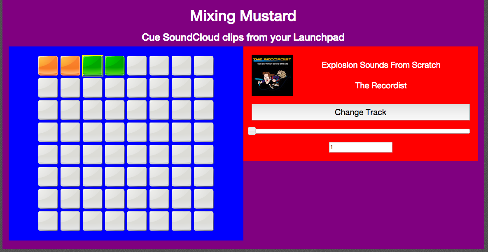

Mixing Mustard
============

To Run
------------
Run 'python -m SimpleHTTPServer' from the project directory. This will host a lightweight server at localhost:8000

To Deploy
------------
Manually copy files via FTP
